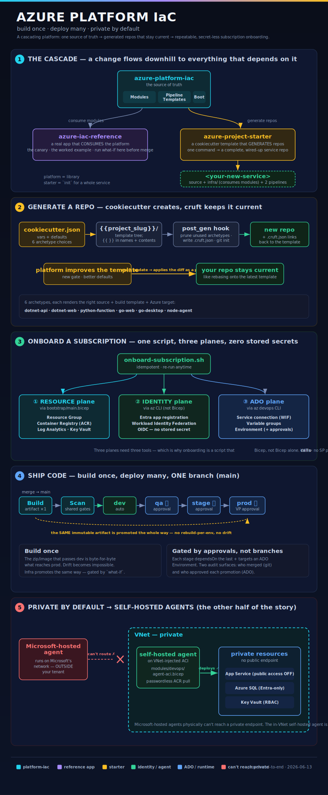

# Azure Platform IAC

Shared Bicep platform modules — the single source of truth for Azure infrastructure patterns. This is the **platform repo**: app repos consume these modules; a change here propagates to all consumers on their next deployment.

## How it all fits



> Prefer words? The full narrative walkthrough — modules → repos, cookiecutter + cruft, subscription onboarding, build-once-deploy-many, and why private endpoints force self-hosted agents — is in **[docs/PLATFORM_PRIMER.md](docs/PLATFORM_PRIMER.md)**.

## Related Repos

| Repo | Purpose |
|------|---------|
| **azure-platform-iac** (this repo) | Platform modules — generic, reusable Bicep templates |
| [azure-iac-reference](../azure-iac-reference) | Reference app — .NET web app consuming platform modules |
| [azure-iac-patterns](../azure-iac-patterns) | Patterns catalog — standalone service templates (Service Bus, Cosmos, etc.) |
| [azure-project-starter](../azure-project-starter) | Cookiecutter template — one command generates a new project repo with pipeline, IaC, and .NET starter |

## Architecture

```
azure-platform-iac/              ← PLATFORM REPO (this one)
├── modules/
│   ├── compute/                 ← app-service, app-service-plan, function-app, container-app-environment, container-app
│   ├── data/                    ← sql-server, sql-database, cosmos-db, storage
│   ├── messaging/               ← service-bus, eventgrid-topic
│   ├── networking/              ← vnet, private-dns-zones, private-endpoint
│   ├── security/                ← key-vault
│   ├── integration/             ← api-management, apim-api
│   ├── identity/                ← entra-app-registration, entra-b2c
│   ├── ai/                      ← foundry-hub, foundry-project, ai-search
│   └── devops/                  ← agent-aci (VNet self-hosted ADO agent)
│
├── bootstrap/                   ← subscription onboarding (ACR, Log Analytics, Key Vault)
│
├── pipelines/templates/         ← shared ADO pipeline templates
│   ├── build-dotnet.yml         → .NET build + test + publish
│   ├── build-python.yml         → Python build + test + package
│   ├── build-go.yml             → Go build + cross-compile (web or desktop)
│   ├── build-node.yml           → Node/TS build + test + package
│   ├── security-gates.yml       → gitleaks, trivy, semgrep, NuGet scan
│   └── deploy-environment.yml   → approval-gated stage: deploy app (+ optional infra)
│
azure-iac-reference/             ← APP REPO (web app)
│   infra/main.bicep              → consumes platform modules
│
azure-iac-patterns/              ← PATTERNS CATALOG
│   identity/main.bicep           → standalone multi-auth + APIM pattern
│   foundry/main.bicep            → standalone Foundry AI agent stack
│   networking/main.bicep         → standalone VNet + private DNS
│
azure-project-starter/           ← COOKIECUTTER TEMPLATE
│   cookiecutter.json             → one command = new project repo
```

## Module Catalog

| Module | Category | What it provisions |
|--------|----------|-------------------|
| `compute/app-service-plan` | Compute | App Service Plan (Linux/Windows, all SKUs) |
| `compute/app-service` | Compute | App Service (any runtime, managed identity, VNet integration) |
| `compute/function-app` | Compute | Function App (.NET/Node/Python/Java, serverless or dedicated) |
| `compute/container-app-environment` | Compute | Container Apps managed environment (VNet integration, Log Analytics, private-internal mode) |
| `compute/container-app` | Compute | Container App (scale-to-zero, passwordless ACR pull, SystemAssigned identity, internal/external ingress) |
| `data/sql-server` | Data | SQL Server (logical server, firewall, private endpoints, Entra admin, Entra-only auth) |
| `data/sql-database` | Data | SQL Database (any SKU, free to hyperscale) |
| `data/cosmos-db` | Data | Cosmos DB account (serverless or provisioned, all consistency levels) |
| `data/storage` | Data | Storage Account v2 (blob/file/table/queue services, soft-delete) |
| `messaging/service-bus` | Messaging | Service Bus namespace (Basic/Standard/Premium) |
| `messaging/eventgrid-topic` | Messaging | Event Grid Custom Topic (CloudEvents or EventGrid schema) |
| `networking/vnet` | Networking | Virtual Network with parameterized subnets |
| `networking/private-dns-zones` | Networking | Private DNS zones + VNet links (all 10 PaaS zones) |
| `networking/private-endpoint` | Networking | Private Endpoint for any PaaS service + optional DNS zone group |
| `security/key-vault` | Security | Key Vault (RBAC authorization, no legacy access policies) |
| `integration/api-management` | Integration | API Management (all tiers, VNet internal mode) |
| `integration/apim-api` | Integration | APIM API definition with multi-auth policies |
| `identity/entra-app-registration` | Identity | Entra ID app registration config contract |
| `identity/entra-b2c` | Identity | Azure AD B2C tenant config contract |
| `ai/foundry-hub` | AI | Foundry Hub + AI Services + model deployments |
| `ai/foundry-project` | AI | Foundry Project (agent scope) |
| `ai/ai-search` | AI | Azure AI Search (RAG vector stores) |
| `ai/foundry-agent-setup` | AI | deploymentScripts for API-only agent creation |
| `devops/agent-aci` | DevOps | Self-hosted ADO agent(s) on VNet-injected ACI — required to deploy into private-endpoint estates (passwordless ACR pull, PAT from Key Vault) |

### Bootstrap

Onboarding a subscription touches **three planes**, and they need different tools — which is why bootstrap is a script that *calls* Bicep, not Bicep alone:

| Plane | What | Tool |
|-------|------|------|
| **Resource** | RG, ACR, Log Analytics, Key Vault | `bootstrap/main.bicep` |
| **Identity** | ADO deploy app reg + WIF + RBAC | `az` CLI (Bicep can't create app regs) |
| **ADO** | service connection, variable groups, environment | `az devops` CLI |

**`bootstrap/onboard-subscription.sh`** orchestrates all three in one idempotent command:

```bash
./bootstrap/onboard-subscription.sh \
  --env dev --subscription <sub-id> \
  --ado-org https://dev.azure.com/<org> --ado-project <project> \
  --project contoso
```

Run it once per env you stand up (each env is typically its own subscription). It's idempotent — safe to re-run — and supports `--dry-run`.

`bootstrap/main.bicep` is **resource-plane only**. ACR and Key Vault names take a per-subscription uniqueness suffix (`uniqueString`) to avoid collisions on these globally-unique names.

**Identity uses Workload Identity Federation (WIF), not a stored secret.** The ADO service connection federates to the deploy app registration via OIDC — there is no SP password to store, rotate, or leak. (The old in-Bicep `deploymentScript` SP-creation path was removed: a fresh script identity can't hold the Entra app-registration + subscription role-assignment rights it would need, so it never worked. The script does this correctly, out-of-band.)

### Passwordless SQL

`data/sql-server` supports Entra-only authentication (`entraOnlyAuth`, default `true`): the server is created with an Entra admin and no usable SQL login. Applications and provisioning identities connect with managed identity (`Authentication=Active Directory Managed Identity`); no password is stored in app configuration.

Prerequisite: the SQL server's managed identity must hold the Entra **Directory Readers** role. Azure SQL uses it to validate managed-identity / service-principal logins and to resolve `CREATE USER ... FROM EXTERNAL PROVIDER`. Bicep cannot assign Entra directory roles, so grant this out-of-band — for example, add each server identity to a group that holds Directory Readers.

### Pipeline Templates

| Template | Purpose |
|----------|--------|
| `pipelines/templates/build-dotnet.yml` | .NET build, test, publish |
| `pipelines/templates/build-python.yml` | Python build, test, package |
| `pipelines/templates/build-go.yml` | Go build with cross-compile (web or desktop) |
| `pipelines/templates/build-node.yml` | Node.js / TypeScript build, test, package |
| `pipelines/templates/security-gates.yml` | Shared scanners — gitleaks, trivy, semgrep, NuGet vuln |
| `pipelines/templates/deploy-environment.yml` | Emits an approval-gated **stage** (no branch gating) that deploys the app (and optionally Bicep infra) to one environment in the promotion chain |

**Add a scanner here → every team gets it on next build.** No repo-by-repo patching.

### Self-Hosted Agents (required once you go private-endpoint)

`modules/devops/agent-aci.bicep` — a self-hosted Azure DevOps agent running on **VNet-injected Azure Container Instances**.

This is **not optional** in a private-by-default estate, and the reason is structural:

> When `enablePrivateEndpoints=true`, app resources (App Service, SQL, Key Vault) have **no public endpoint** — they are reachable only from inside the VNet. **Microsoft-hosted ADO agents run on Microsoft's network, outside your tenant**, so they physically cannot route to those resources. Deploys hang and time out. A **VNet-integrated self-hosted agent is the only thing that can deploy into private-endpoint-locked infrastructure.**

So the regulatory "private-by-default" posture *forces* self-hosted agents — they're the other half of the private-endpoint story. The module:

- runs the agent container (built from `modules/devops/agent-image/`) on ACI, injected into a VNet subnet delegated to `Microsoft.ContainerInstance/containerGroups`;
- pulls its image **passwordlessly** (user-assigned identity + AcrPull, cross-RG aware);
- takes its registration **PAT from Key Vault** (agent registration has no Workload Identity Federation path — it's the one unavoidable secret);
- scales by fixed `agentCount` (each container group = one persistent agent).

Pipelines then target `pool: name: <your-pool>` and deploy through the in-VNet agent. The companion `deploy-environment.yml`/app pipelines work unchanged — only the agent pool differs.

## Design Rules

1. **Every parameter has `@description`** — self-documenting. No guessing.
2. **Sensible defaults** — `osKind='linux'`, `sku='Standard'`, `minTlsVersion='1.2'`.
3. **`environment` tag on everything** — consistent tagging.
4. **Managed identity over connection strings** — `app-service` and `function-app` default to `SystemAssigned`.
5. **`disablePublicAccess` over `enablePublicEndpoints`** — private-by-default mindset.
6. **Single responsibility** — `storage.bicep` creates the account + service parents. Containers/queues are added by the caller.
7. **Outputs are chainable** — every module outputs `id`, most output `name`, `endpoint`, or `managedIdentityPrincipalId`.

## How App Repos Consume

### Relative path (local dev + CI)
```bicep
module appService '../../azure-platform-iac/modules/compute/app-service.bicep' = {
  name: 'contoso-app-dev'
  params: ...
}
```

### ADO template reference (pipeline)
```yaml
resources:
  repositories:
    - repository: platform
      type: git
      name: azure-platform-iac
      ref: main

stages:
  - stage: Deploy
    jobs:
      - job: DeployInfra
        steps:
          - checkout: self
          - checkout: platform
          # app repo's main.bicep references platform modules via relative path
```

### Module Registry (future)
```bicep
module appService 'br:contosoacr.azurecr.io/bicep/modules/app-service:v1.2.0' = {
  name: 'contoso-app-dev'
  params: ...
}
```

## Versioning

SemVer. Breaking changes = major version bump. App repos pin to a specific git tag. The `ref: main` pattern can be changed to `ref: v1.2.0` for pinning.

## Governance

- **PR required** for every platform module change.
- **Validate all consumers** — run `what-if` against at least one app repo before merge.
- **Backward compatibility** — add params, don't remove. Deprecate with `@description('DEPRECATED: use X instead')`.
- **No app-specific logic** — platform modules are generic templates.
